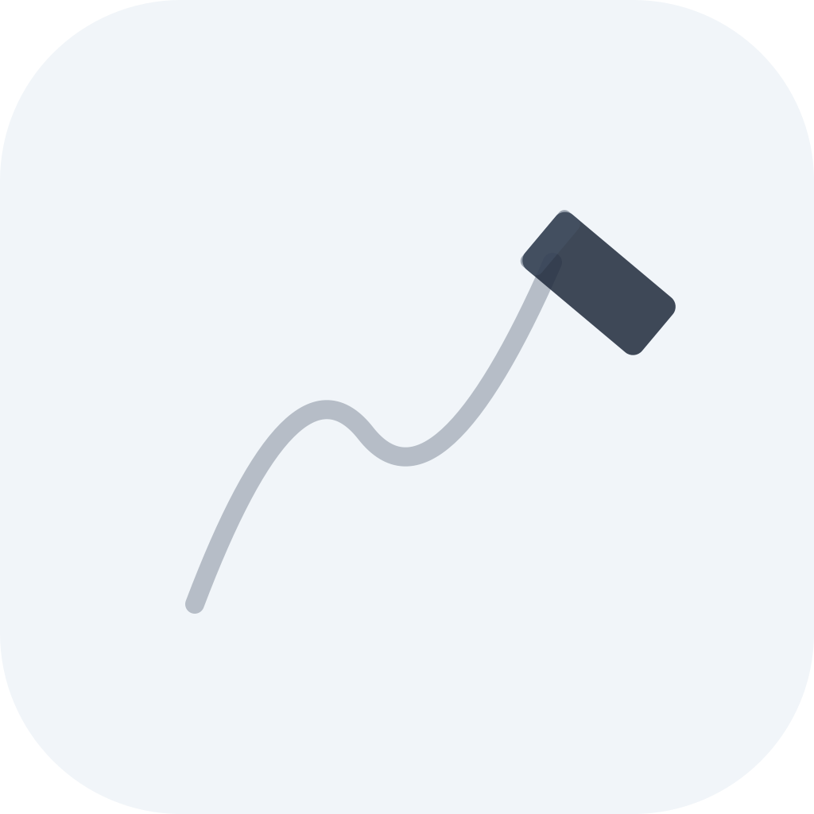
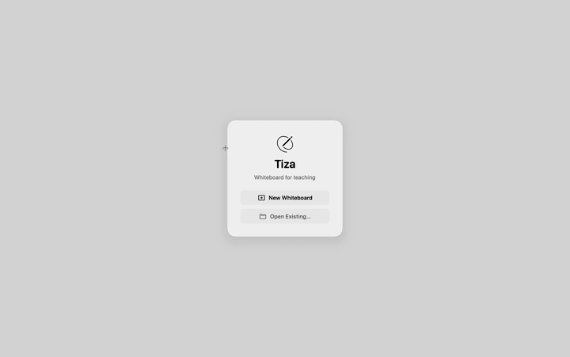
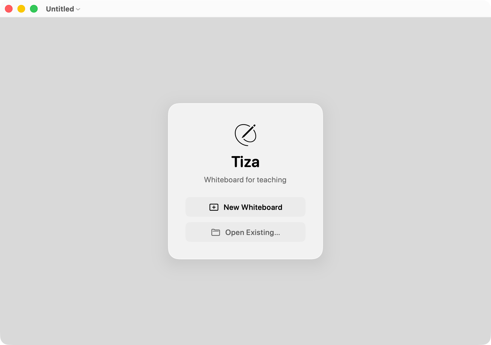

<p align="center">
  
</p>

<h1 align="center">Tiza</h1>

<p align="center">
  A free, native macOS whiteboard app built for teaching.
  <br>
  <em>Tiza means "chalk" in Spanish.</em>
</p>

<p align="center">
  
  
  
</p>

---

Microsoft Whiteboard is being retired, so I built Tiza as a replacement — a fast, lightweight alternative that runs natively on macOS with no account, no subscription, and no cloud dependency. It's designed for screen sharing during live classes, but works just as well for sketching ideas or taking visual notes.

<p align="center">
  
</p>

## Features

### Drawing
- **Pen & highlighter** with pressure-sensitive smoothing
- **Eraser** for quick corrections
- **Shape recognition** — draw a rough circle, rectangle, or triangle and it snaps to a perfect shape
- **Shape tools** — rectangle, ellipse, triangle, diamond, star, line, arrow
- **Text** with presets (H1, H2, H3, body), bold, underline, and font styles
- **Stroke styles** — solid, dashed, and dotted lines
- **Fill color** and **opacity control** per element
- **Image support** — drag and drop images onto the canvas

### Selection & Editing
- **Smart selection** — left-to-right selects enclosed elements, right-to-left selects touched elements (AutoCAD-style)
- **Smart guides** — alignment guides appear when moving elements near others
- **Element grouping** and **locking**
- **Alignment tools** — left, center, right, top, middle, bottom, distribute
- **Animated delete & alignment** — elements implode/slide smoothly

### Canvas
- **Infinite canvas** — pan and zoom freely
- **Multiple boards** per document
- **Board backgrounds** — white, dark, grid, dotted grid, lined
- **Export** boards as PNG or PDF

### Teaching Tools
- **Ruler & protractor** — on-screen instruments for geometry
- **Laser pointer** (hold Space) with trailing effect
- **Presentation mode** with toolbar auto-hide

### Design
- Built with macOS 26 **Liquid Glass** for a native, polished look
- **Dock-style toolbar** with magnification on hover and grouped tools
- Dark mode support
- Keyboard shortcuts for every tool

<p align="center">
  
</p>

## Keyboard Shortcuts

| Key | Tool | | Key | Tool |
|-----|------|-|-----|------|
| V | Select | | L | Line |
| P | Pen | | A | Arrow |
| M | Highlighter | | R | Rectangle |
| E | Eraser | | O | Ellipse |
| T | Text | | G | Triangle |
| C | Connector | | D | Diamond |
| B | Table | | S | Star |
| Q | Equation | | | |

| Shortcut | Action |
|----------|--------|
| ⌘G | Group |
| ⌘⇧G | Ungroup |
| ⌘L | Lock/Unlock |
| ⌘C / ⌘V | Copy / Paste |
| ⌘⇧N | New board |
| PageDown / PageUp | Next / Previous board |
| Delete | Delete selection |
| Esc | Cancel / deselect |
| Space (hold) | Laser pointer |
| Shift (hold) | Constrain shapes |

## Building

Tiza requires **macOS 26 (Tahoe)** and **Xcode 26+**.

```bash
# Install XcodeGen
brew install xcodegen

# Generate the Xcode project and open it
xcodegen generate
open Tiza.xcodeproj
```

Or build from the command line:

```bash
xcodegen generate
xcodebuild -scheme Tiza -destination 'platform=macOS,arch=arm64' build
```

## Architecture

SwiftUI + AppKit hybrid. The document layer and UI overlays use SwiftUI, while the canvas is a custom `NSView` rendered with Core Graphics for maximum performance during freehand drawing.

```
Tiza/
├── App/              # App entry point
├── Canvas/           # NSView canvas, renderer, camera, hit testing
├── Document/         # Data model, persistence, element types
├── Export/           # PNG and PDF export
├── Geometry/         # Coordinate type aliases
├── Instruments/      # Ruler and protractor
├── Presentation/     # Laser pointer, presentation mode
├── Tools/            # Drawing tools, selection, shape recognition
├── UI/               # SwiftUI toolbar, context menus, overlays
└── Resources/        # Assets, entitlements, Info.plist
```

## Contributing

Contributions are welcome! See [CONTRIBUTING.md](CONTRIBUTING.md) for development setup and guidelines.

## License

Tiza Non-Commercial License. See [LICENSE](LICENSE) for details.
